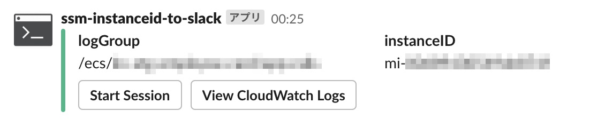
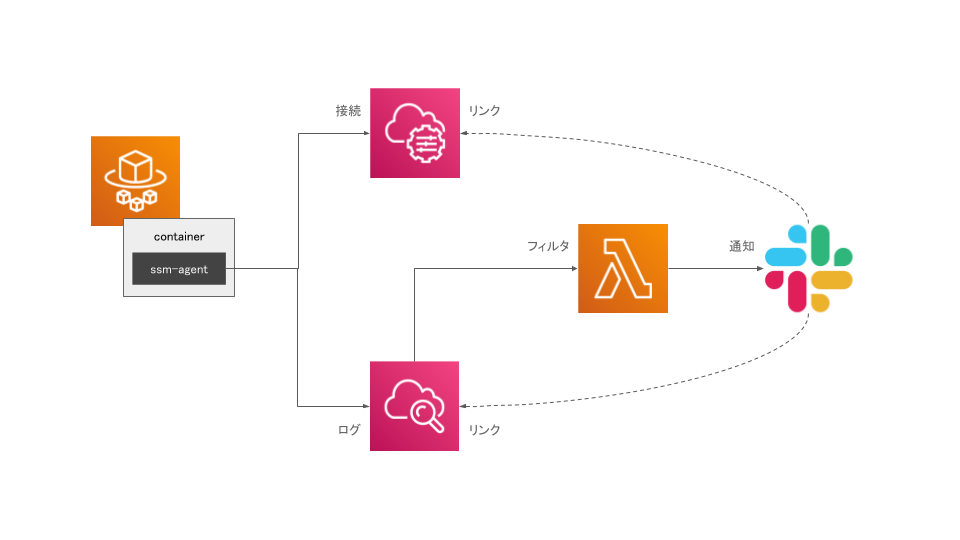

# SSM instanceID to slack

## ■ Overview

ssm-agentから出力されたログから、SSM Session Managerでセッションを開始するリンクを、Slackに通知します。

## ■ Architecture

## ■ Install

### ● [Slack App](https://api.slack.com/apps)

- OAuth & PermissionsのScope設定
  - Scope
    - `channels:read`
    - `channels:write`
    - `groups:write`
- OAuth & PermissionsのTokenをコピー
  - OAuth Access Token
  - Bot User OAuth Access Token

### ● Lambda 関数

- [最新のlambda.zip](https://github.com/suwa-sh/ssm-instanceid-to-slack/releases/latest) をダウンロード
- [Lambda関数の作成](https://ap-northeast-1.console.aws.amazon.com/lambda/home?region=ap-northeast-1#/create/function)
  - 関数名: `ssm-instanceid-to-slack`
  - ランタイム: `Python 3.8`
  - 関数コード.アクション → zipファイルをアップロード: `ダウンロードした最新のlambda.zip`
  - 環境変数
    - SLACK_TOKEN: `Slack App の OAuth Access Token`
    - SLACK_BOT_TOKEN: `Slack App の Bot User OAuth Access Token`
    - SLACK_BOT_ICON: `任意`
    - SLACK_BOT_NAME: `任意`
    - Slack の public channel に通知する場合
      - SLACK_CHANNEL_NAME: `public channel名`
    - Slack の private channel に通知する場合
      - SLACK_CHANNEL_ID: `private channel ID`

### ● CloudWatch Logs サブスクリプションフィルタ

- [ssm-agent のログが出力される log group](https://ap-northeast-1.console.aws.amazon.com/cloudwatch/home?region=ap-northeast-1#logsV2:log-groups).アクション → Lambda サブスクリプションフィルタを作成
  - Lambda 関数: `ssm-instanceid-to-slack`
  - ログの形式: `その他`
  - サブスクリプションフィルターのパターン: `Successfully registered the instance with AWS SSM`
    - ssm-agentが接続を開始したときのログメッセージ
